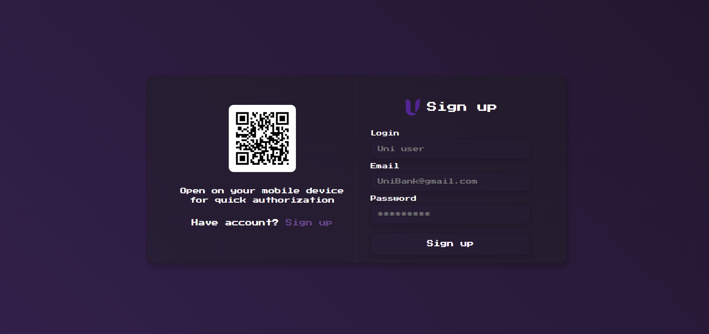
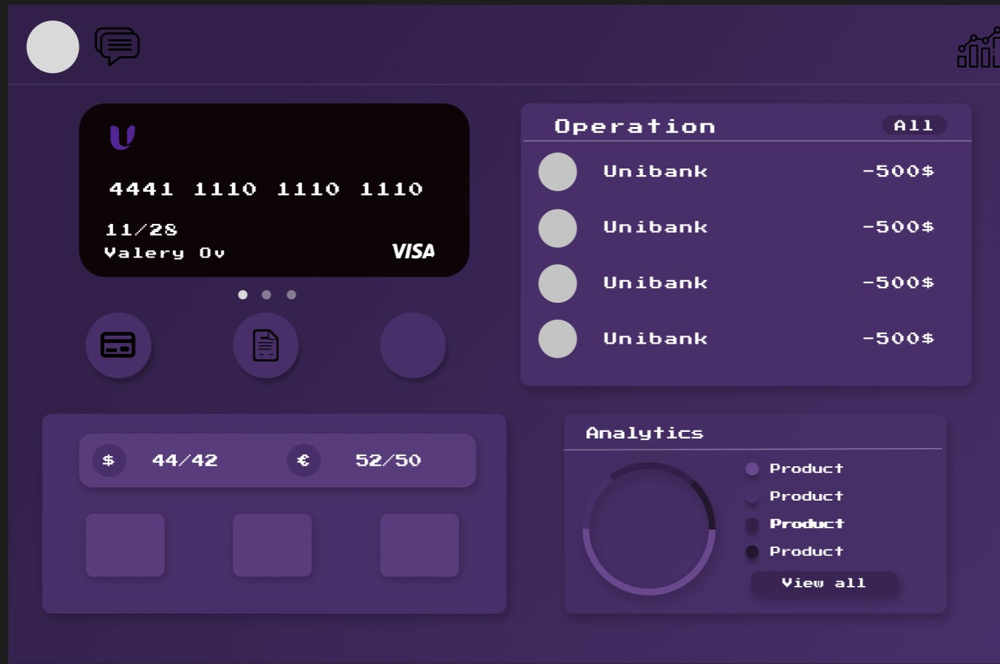
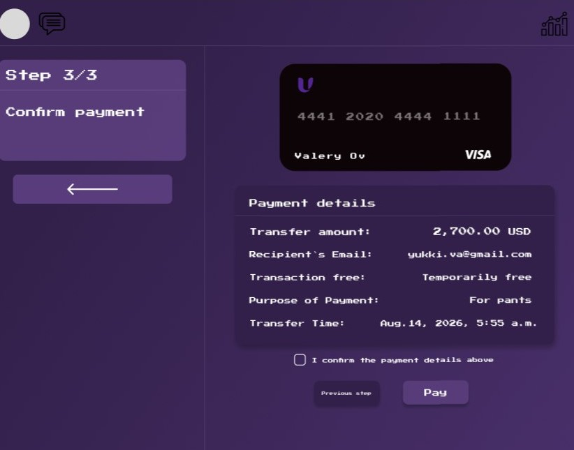

# UniBank 🏦

UniBank is a modern banking web application built with **React + TypeScript**.  
It provides a secure and intuitive interface for user registration, account management, and money transfers.

---

## ✨ Features
- **User Registration**: Create a new account with secure validation.
- **Main Menu Dashboard**: Access account balance, transaction history, and quick actions.
- **Money Transfers**: Send funds instantly between accounts with confirmation flow.
- **Responsive Design**: Optimized for desktop and mobile devices.
- **TypeScript Safety**: Strong typing for reliable and maintainable codebase.

---

## 🚀 Tech Stack
- **React 18** with functional components
- **TypeScript** for type safety
- **SCSS (BEM structure)** for styling
- **React Router** for navigation
- **REST API integration** for dynamic data

---

## 📸 Screenshots

### Registration Page


### Main Menu Dashboard


### Money Transfer Flow


---

## ⚙️ Installation

Clone the repository and install dependencies:

```bash
git clone https://github.com/your-username/unibank.git
cd unibank
npm install
